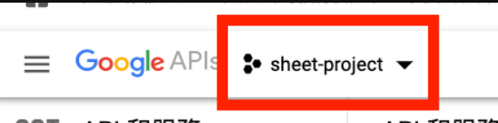
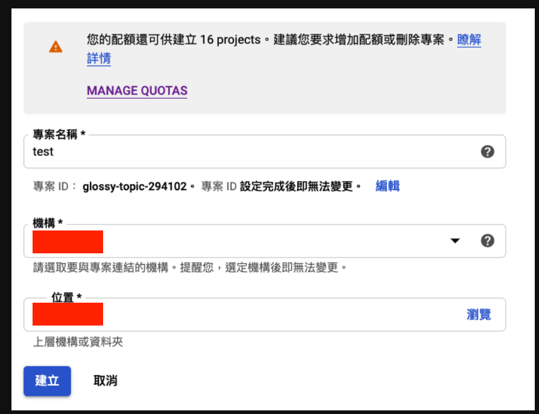
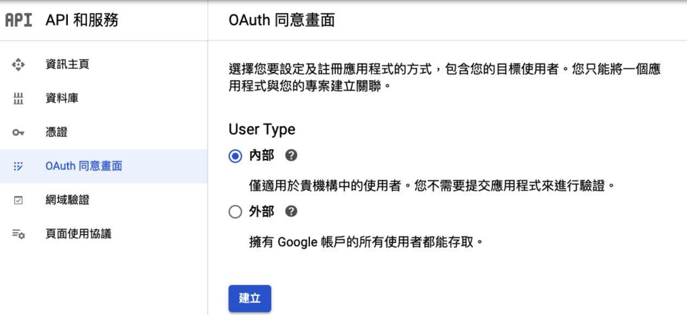
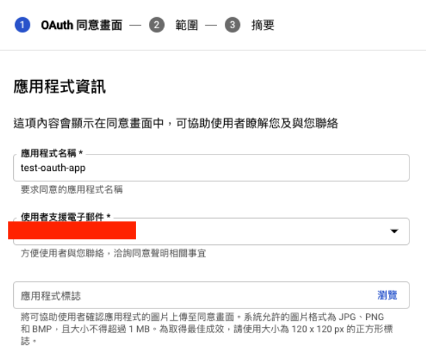
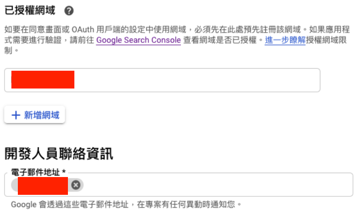
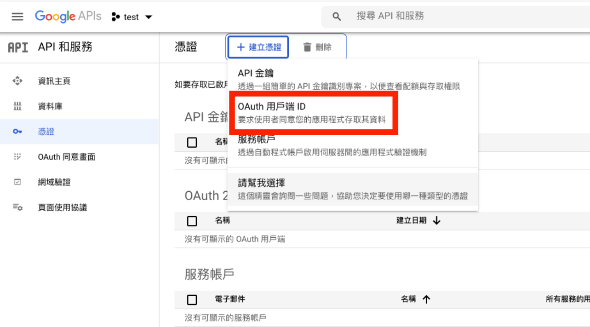
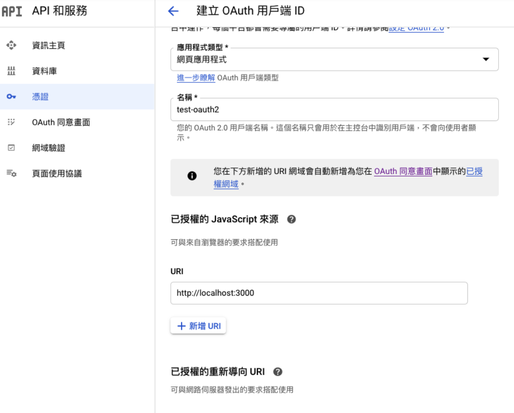
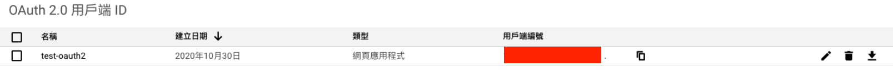
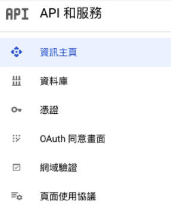
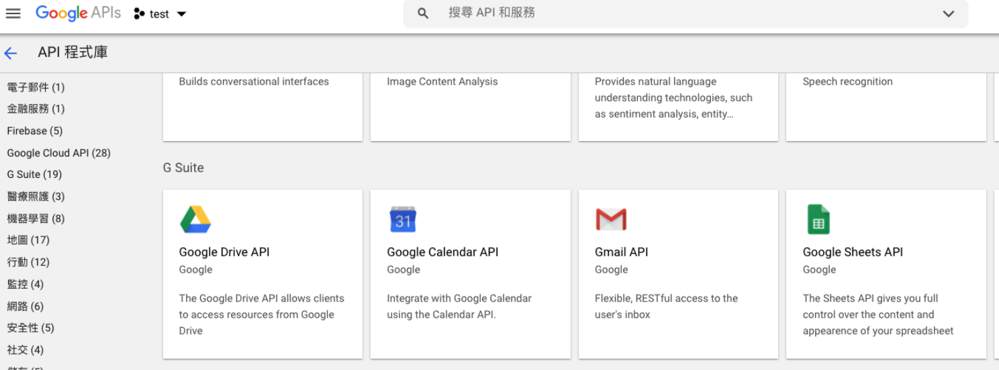

# google-oauth2
===
## 先去辦oauth2 api申請
* 參考資料：
    *  [[教學] Google OAuth 2.0 申請與使用指南](https://xenby.com/b/245-%E6%95%99%E5%AD%B8-google-oauth-2-0-%E7%94%B3%E8%AB%8B%E8%88%87%E4%BD%BF%E7%94%A8%E6%8C%87%E5%8D%97)
    *  [刪除權限來這邊](https://myaccount.google.com/permissions)
1. 來[Google API Console](https://console.developers.google.com/)新增專案


2. 設定oauth2同意畫面(沒截圖的就是沒寫也沒關係)



3. 建立憑證


4. 點擊右邊下載，下載json檔，把它放到專案裡面

5. 接著到api程式庫去啟用api，點擊資料庫

6. 選擇google sheet api -> 啟用

7. 設定的差不多了，可以去寫code了😃😃😃
---
## 寫code囉～～
1. 先安裝google套件```npm install googleapis```
2. 然後參考[這邊](https://github.com/googleapis/google-api-nodejs-client/blob/master/samples/sheets/quickstart.js)
3. 剩下的程式碼改寫跟細節說明，我寫在程式碼裡面，完成😆😆😆
